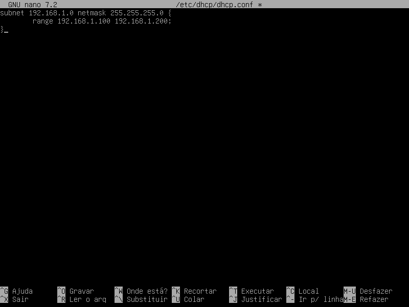

# DHCP

## Instalação
- dnsmasq

- Configuração
1º - Arquivo de configuração do dnsmasq é:

/etc/dnsmasq.conf`


`/etc/dnsmasq.d/exemplo.conf`

vamos criar um arquivo (exemplo.conf) no diretório (dnsmasq.d)todas as configurações no arquivo(exemplo.conf) vai migra para dnsmasq.conf.

2º - Editando o arquivo exemple.conf a configuração padrão é essa:

Define a interface de rede que vai ser dhcp

EX: interface= eht1
Define a faixa de ip (inicial , ip final , mascara de rede , tempo que o dispositivo fica com o ip)

EX: dhcp-range= 192.168.1.10, 192.168.1.254 , 255.255.255.0 , 12h
Define o gateway da rede

EX: dhcp-option= 3 , 192.168.1.254 (3: Identifica o Gateway)
Define outro dns (Opicional)

EX: dhcp-option= 6 , 8.8.8.8 (6: Identifica o servidor DNS)
Define um domínio (Opicional)

EX: dhcp-option= 15, nome-domínio (15: Especifica um domínio se caso você esteja em um)
Informa onde será o log do serviço

EX: log-facility= /var/log/dnsmasq.log
Informa os IPs fixos

EX:dhcp-host= Ip-da-máquina, Mac-da-máquina

```cpp
default-lease-time 600;
max-lease-time 7200;
option subnet-mask 255.255.255.0;
option broadcast-address 192.168.2.255;
option routers 192.168.2.254;
option domain-name-servers 192.168.2.1, 8.8.8.8;

subnet 192.168.2.0 netmask 255.255.255.0 {
  range 192.168.2.2 192.168.2.20;
}
```

Após editar o arquivo, salve-o e feche-o.

Inicie o serviço com o comando:

service isc-dhcp-server start

Caso não tenha errado na sintaxe o serviço iniciará normalmente ou apresentará uma mensagem de erro.

Arquivo onde pode ser localizado qual IP foi atribuído a qual MAC Address:

/var/lib/dhcp/dhcpd.leases
## Configuração

Incluir o(s) nome(s) e o conteúdo do(s) arquivo(s) de configuração.

- Distribuir um intervalo (*range* em inglês) de endereços IP; (15 pontos)
- 
  
  
- Reservar 2 endereços (IP fixo) fora do intervalo do item anterior. (5 pontos)
- 
  

## Teste
service isc-dhcp-server restart


