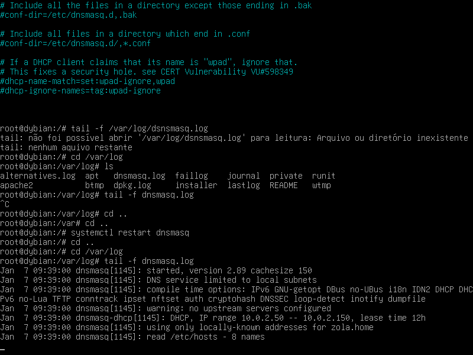

# DHCP

## Instalação
- dnsmasq

- Configuração
1º - Arquivo de configuração do dnsmasq é:

/etc/dnsmasq.conf`

`/etc/dnsmasq.conf`

todas as configurações serão feitas no arquivo(dnsmasq.conf).

2º - Editando o arquivo dnsmasq.conf a configuração padrão é essa:

Define a interface de rede que vai ser dhcp

EX: interface= enth0
Define a faixa de ip (inicial , ip final , mascara de rede , tempo que o dispositivo fica com o ip)

EX: dhcp-range= 192.168.1.10, 192.168.1.254 , 255.255.255.0 , 12h
Define o gateway da rede

EX: dhcp-option= 3 , 192.168.1.254 (3: Identifica o Gateway)
Define outro dns (Opicional)

EX: dhcp-option= 6 , 8.8.8.8 (6: Identifica o servidor DNS)
Define um domínio (Opicional)

EX: dhcp-option= 15, nome-domínio (15: Especifica um domínio se caso você esteja em um)
Informa onde será o log do serviço

EX: log-facility= /var/log/dnsmasq.log
Informa os IPs fixos

EX:dhcp-host= Ip-da-máquina, Mac-da-máquina

Após editar o arquivo, salve-o e feche-o.

Inicie o serviço com o comando:

service isc-dhcp-server start

Caso não tenha errado na sintaxe o serviço iniciará normalmente ou apresentará uma mensagem de erro.

Arquivo onde pode ser localizado qual IP foi atribuído a qual MAC Address:

/var/lib/dhcp/dhcpd.leases
## Configuração

Incluir o(s) nome(s) e o conteúdo do(s) arquivo(s) de configuração.

- Distribuir um intervalo (*range* em inglês) de endereços IP; (15 pontos)

- O endereço IP fixo, com 10.0.2.15, a um dispositivo específico usando o dnsmasq.

- 
  
  
- Reservar 2 endereços (IP fixo) fora do intervalo do item anterior. (5 pontos)
- acessando:
`nano /var/dnsmasq.conf`
colocamos o endereço fixo como podemos ver abaixo:
`dhcp-host=00::11::22::33::44:55:66, 10.0.2.15`

  

## Teste

Verifique a configuração do dnsmasq em busca de erros ou problemas antes de iniciar o serviço, com o comando: 

`dnsmasq --test`

É importante fazer um restart:

`systemctl restart dnsmasq`

e visualizar o status do dnsmasq

`systemctl status dnsmasq`

Acessando atráves de:
`cd /var/log`
depois usando o comando:
`tail -f dnsmasq.log`
mostrará o log como a imagem abaixo:

