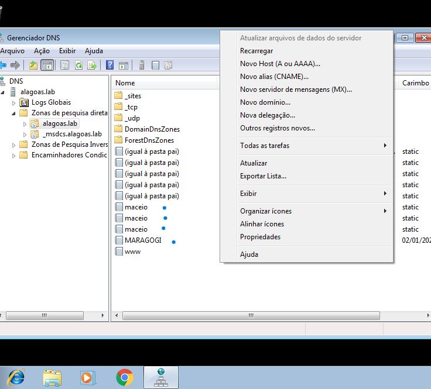
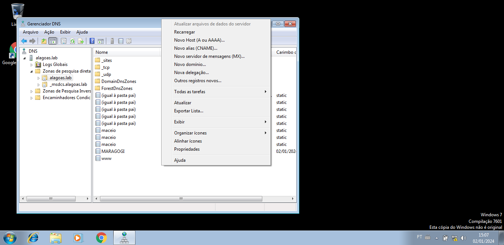
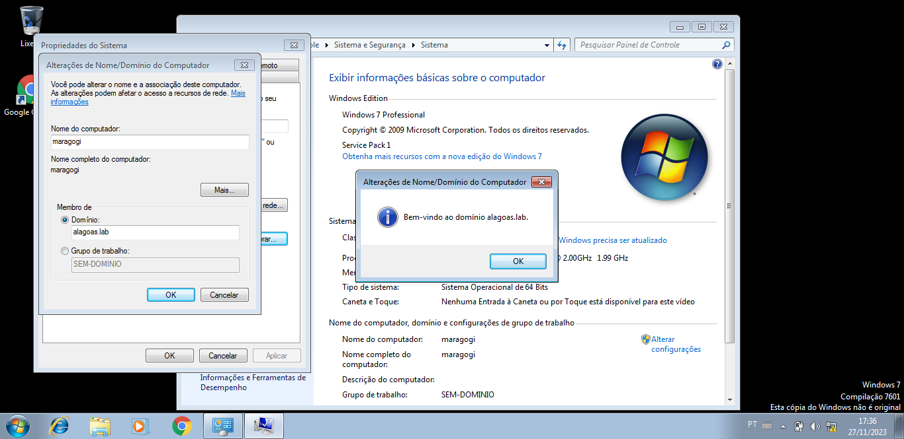
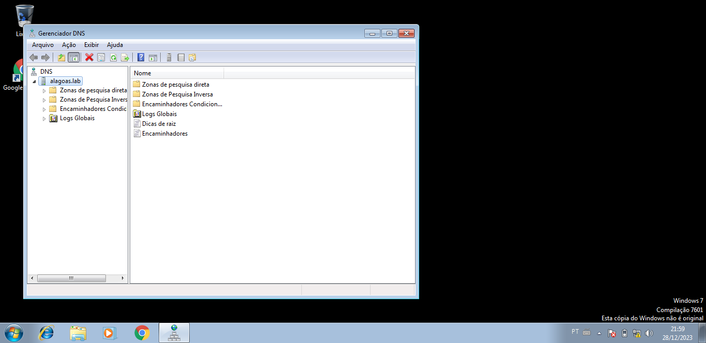

# DNS

## Instalação
No Ubuntu/Debian, abra o terminal e execute os seguintes comandos:
```
apt-get install samba-ad-dc krb5 smbclient

```

```
sudo apt update
sudo apt install bind9
```

## Configuração
Configurando Zonas
 -Verifique o nome de domínio atual:

`hostnamectl`

Defina o nome de domínio:

`sudo hostnamectl set-hostname maceio.alagoas.lab`

- Alpine `(rc-service samba stop)`
- Configurando nosso domínio usando:
```
samba-tool domain provision --use-rfc2307 --interactive
```
  
Edite o arquivo named.conf para adicionar suas zonas. Por exemplo:


`sudo nano /etc/bind/named.conf`

Incluir o(s) nome(s) e o conteúdo do(s) arquivo(s) de configuração.

Cinco registros (4 pontos cada):

- 3 do tipo A (Endereços);

- 2 do tipo CNAME (`www` e `docs`);


## Teste
Domínio




 Acessando o DNS: 



Configurando o DNS:

