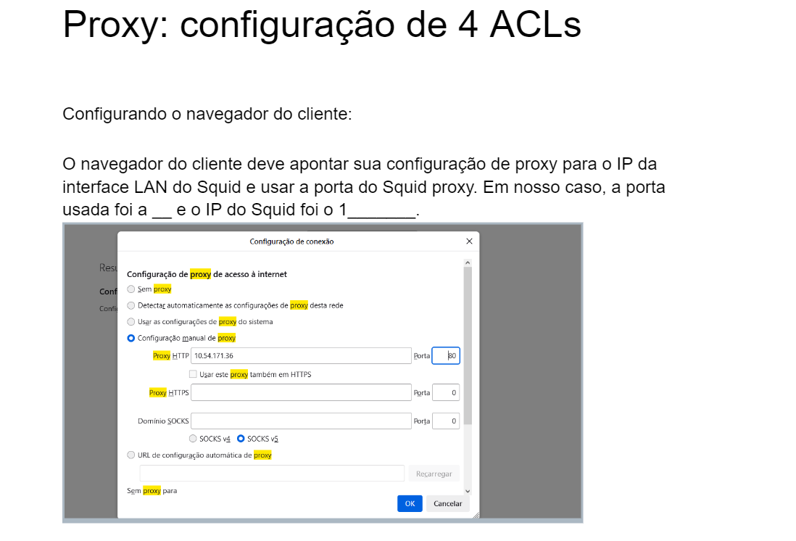
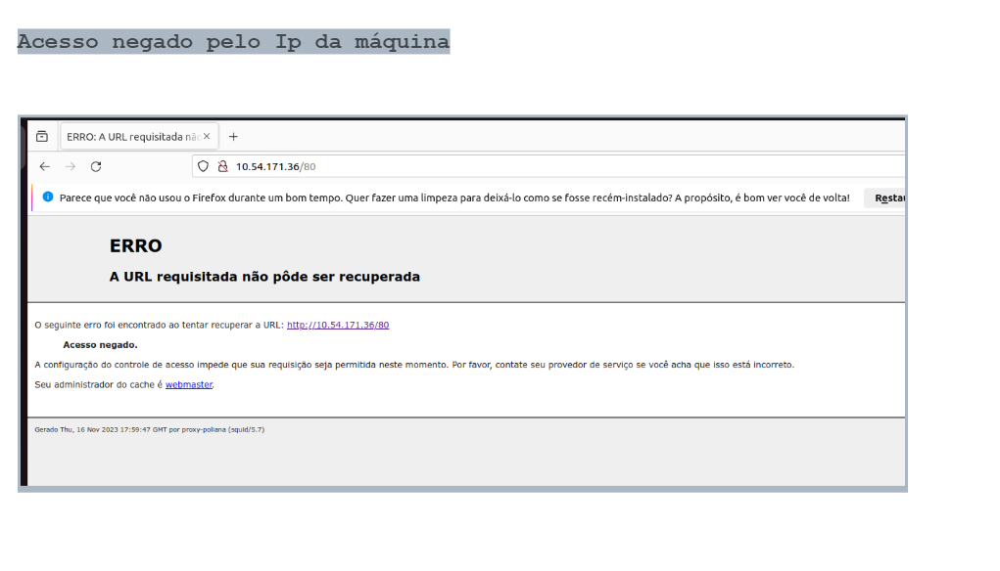
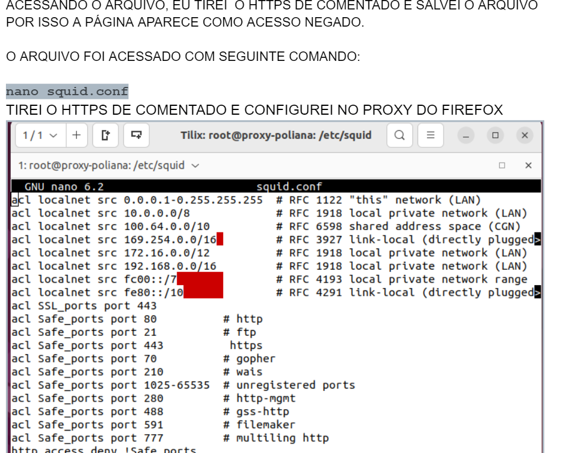

# PROXY

## Instalação
No Linux podemos instalar o squid através do comando:

`sudo apt-get install squid`

Vamos verificar se o Squid está sendo executado de forma satisfatória. Então, vamos utilizar o seguinte comando: 
   
`sudo service squid status`


## Configuração

Configuração do Squid
Após a instalação, vamos iniciar a fase de configuração. Dessa forma vamos acessar o diretório  /etc/squid e em seguida vamos criar uma cópia do arquivo de configuração “squid.conf”.
```
    sudo cd /etc/squid 
    sudo cp squid.conf squid.conf.backup

```

Vamos editar o arquivo “squid.conf” e vamos apagar todas as linhas desse arquivo. O motivo de estarmos apagando as linhas do arquivo, é para que o leitor possa identificar de forma segmentada cada parte da configuração.

`sudo nano squid.conf`

Vamos apagar todas as linhas do arquivo. Logo depois, vamos adicionar linhas que representam ACLs de acesso.
Posteriormente, vamos adicionar as seguintes linhas no arquivo “squid.conf”:

```
    acl SSL_ports port 443
    acl Safe_ports port 80 # http
    acl Safe_ports port 21 # ftp
    acl Safe_ports port 443 # https
    acl CONNECT method CONNECT
```

 - Bloqueia acesso de portas nao Safe_ports

    `http_access deny !Safe_ports`

## Nega CONNECT para outras portas que nao seja SSL ports
```
    http_access deny CONNECT !SSL_ports

    #porta que o squid vai ouvir / Squid listen port
    http_port 3128

    #Permitir apenas computadores da minha rede/ only my network is allowed
    acl Minha_Rede src 192.168.10.0/24
```

Em seguida, vamos reiniciar o Squid para que as configurações façam efeito. Posteriormente, vamos verificar o status do Squid. Depois disso, teste a conexão do cliente com a internet.
```
    sudo service squid restart
    sudo service squid status
```

Além disso, caso tenha erros, podemos verificar o syslog. Então, para isso podemos usar o comando abaixo:

`sudo cat /var/log/syslog | grep squid`

Agora e só ir no navegador e configura o proxy, por padrão:

- 1.Abra o navegador.

- 2.No menu, selecione Configurações ou Opções.

- 3.Na seção Rede, selecione Configurações de proxy.

- 4.Marque a caixa Usar um servidor proxy.

- 5.Insira o endereço IP do servidor proxy e a porta.

`http_access permissão NOME_DA_ACL`


Incluir o(s) nome(s) e o conteúdo do(s) arquivo(s) de configuração.




Incluir o(s) nome(s) e o conteúdo do(s) arquivo(s) de configuração.

Fazer a configuração de 4 ACLs distintas, conforme a atividade passada em sala de aula.

## Teste





