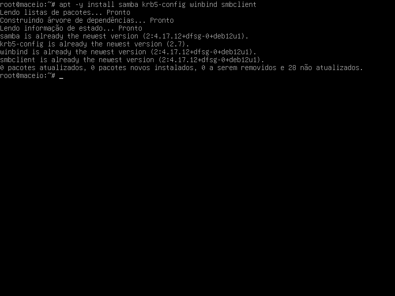
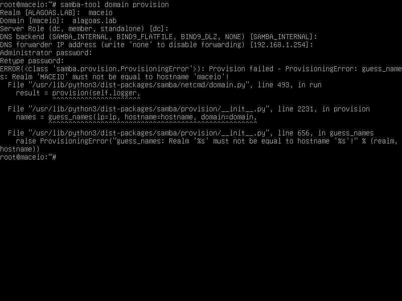
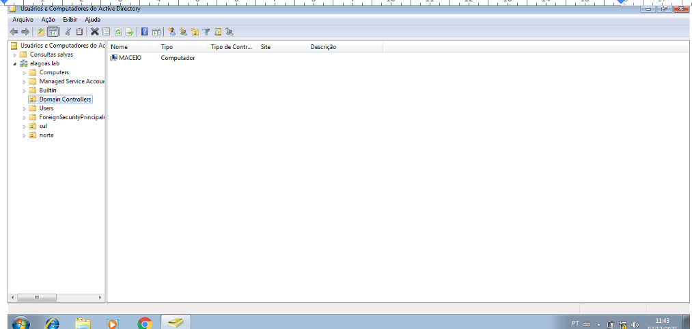
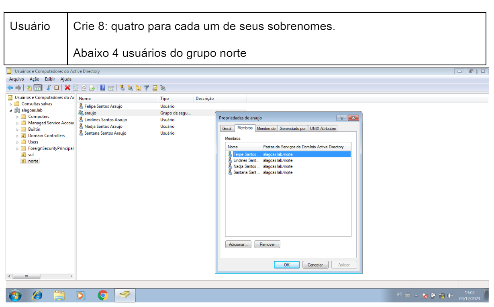
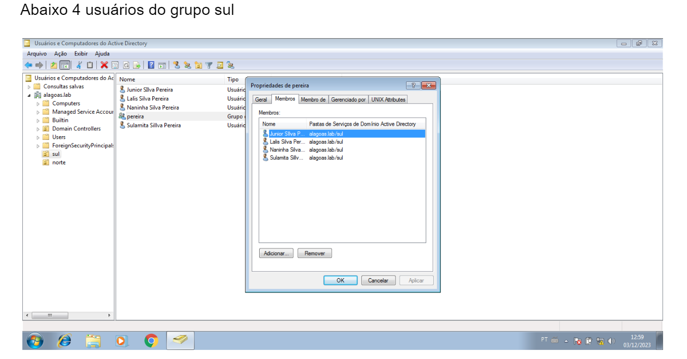
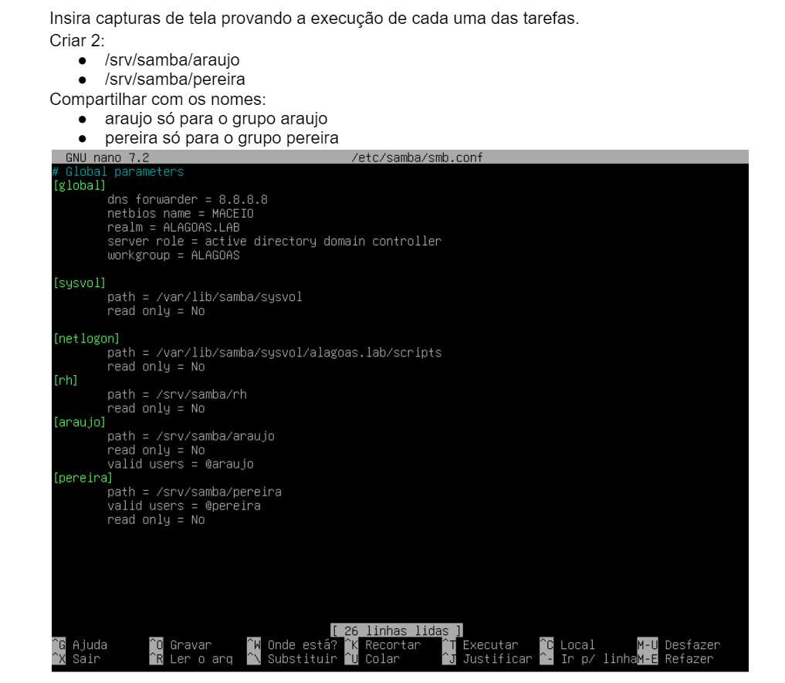
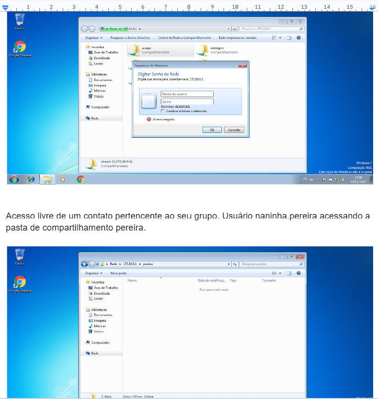
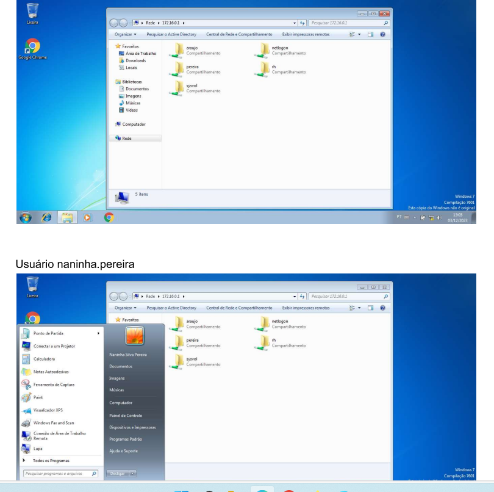

# SMB

## Instalação
Instalando o Samba via Repositório
A linha abaixo instala o Samba na versão do repositório( Version 4.5.12-Debian em 08/11/2017). Também instala algumas ferramentas básicas necessárias:
```
apt -y install samba krb5-config winbind smbclient

Primeiro é necessário remover ou renomear o smb.conf default:

mv /etc/samba/smb.conf /etc/samba/smb.conf.org
```



## Configuração

Incluir o(s) nome(s) e o conteúdo do(s) arquivo(s) de configuração.
Comando para provisonamento:
``` 
samba-tool domain provision 
 ```

 

Copiar o arquivo de configuração Kerberos gerado pelo provisionamento:
``` 
cp /var/lib/samba/private/krb5.conf /etc/

```
Para criar o diretório /srv/samba/rh
```
mkdir -p /srv/samba/rh

```
 Após isso configurei a interface de rede na máquina linux  e posteriormente no windows7.

 Vamos editar o arquivo /etc/samba/smb.conf
 ```
 nano /etc/samba/smb.conf

 ```
 No arquivo criamos uma rede de compartilhamento chamado rh.
 Acessamos o diretório com o seguinte comando:
 
   `cd /srv/samba/rh`
 


Acessamos com o ip da maquina virtual e criamos um arquivo na máquina real e posteriormente na máquina do windows7. 
\\192.000.0.0 -colocar o que apareceu na máquina linux.
1. Criar 2 grupos para dois de seus sobrenomes;
Abaixo temos o grupo norte e sul:

  

3. Criar 4 usuários, dois para cada um dos sobrenomes;

 

Outros quatros usuários:



4. Compartilhar duas pastas com dois de seus sobrenome, compartilhado para o grupo com o sobrenome correspondente.
  
  Abaixo como criar os grupos:

   


## Teste
- Demonstração de como acessar e não acessar com os respectivos usuários:

 

- Demonstração dos usuários 

